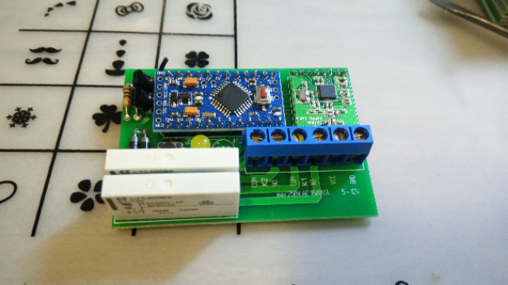
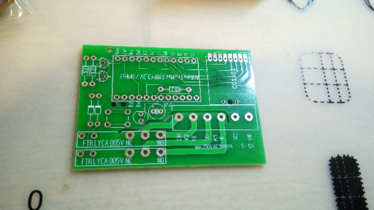
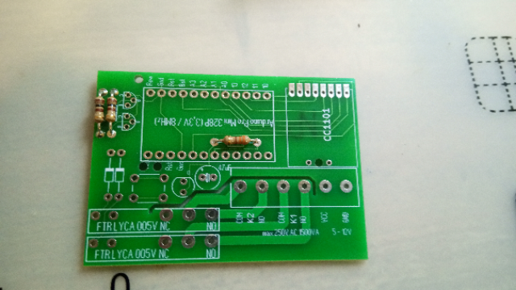
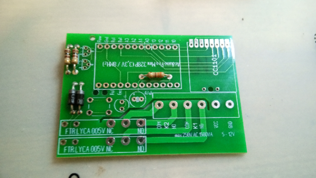
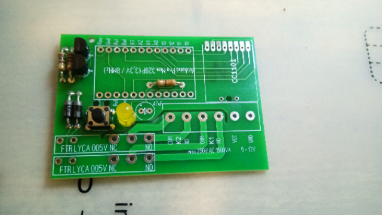
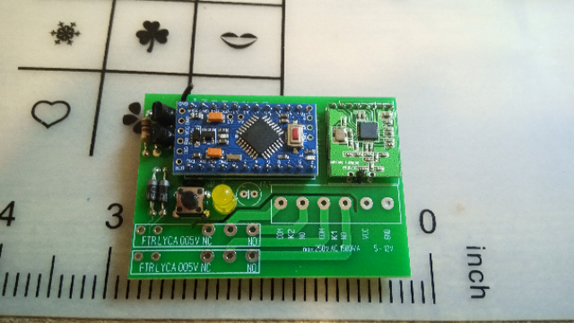

# HM-LC-Sw2-12V
# 2x 6A 230V Schaltkontakt; Steuerspannung 5-12V 

## benötigte Hardware
* 1x Arduino Pro Mini **ATmega328P (3.3V/8MHz)**
* 1x CC1101 Funkmodul **(868 MHz)**
* 1x FTDI Adapter (wird nur zum Flashen benötigt)

* 1x https://www.reichelt.de/my/?????

**ACHTUNG: ja nach Hersteller der Arduinos kann die maximale Eingangsspannung variieren. (Siehe Datenblatt) Falls keins vorhanden ist, maximale Spannung an VCC 8,5V!**

[Software je nach Projekt](https://github.com/jp112sdl) von Jérôme

